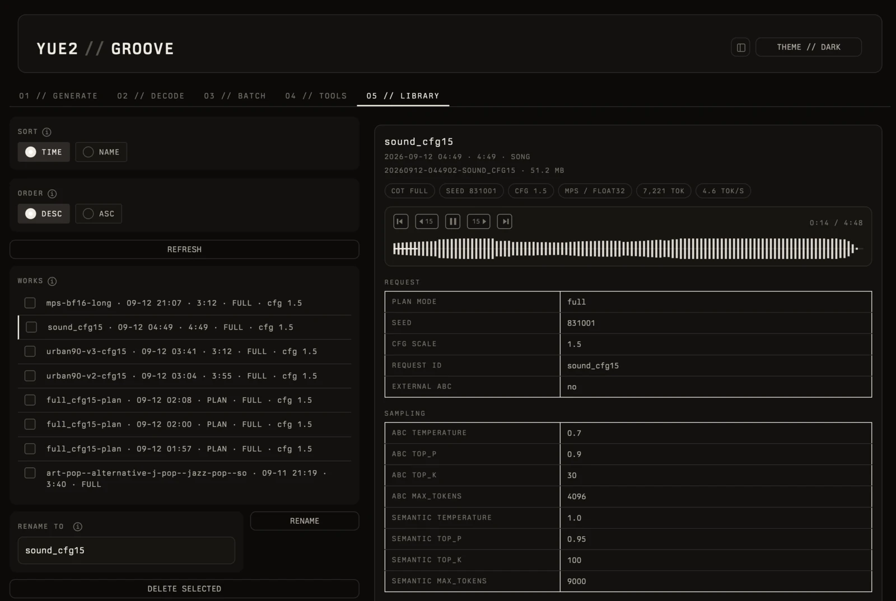
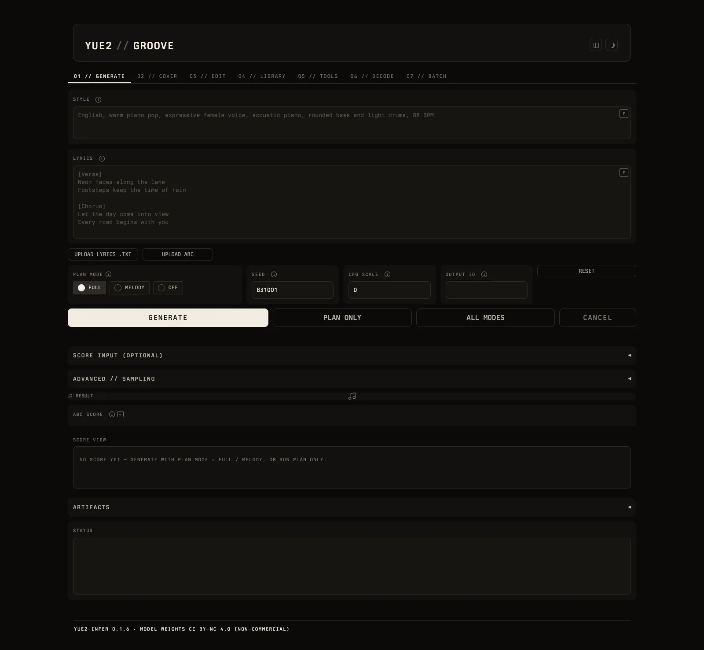

# YUE2 // GROOVE

An unofficial web UI for [YuE2](https://github.com/multimodal-art-projection/YuE), the
open full-song music generation model with an editable symbolic plan. Give it a style
prompt and lyrics; it plans a melody-and-chord score (ABC), then renders a complete
48 kHz stereo song. This UI puts every control of the official CLI/Python API in the
browser, adds a library of your generated works, and runs as a small local service.

- **01 // GENERATE** — style + lyrics (+ optional ABC score) → editable plan → song.
  Plan mode `full / melody / off`, seed, CFG scale, all seven sampling parameters of both
  phases, budget presets, cancel, live progress, a rendered score, one-click artifact download.
  **ALL MODES** runs the same text request as `full` + `melody` + `off` and compares them.
- **02 // DECODE** — re-decode a saved `latent.npy` with another decoder
  (source / standard / legacy / custom VAE, full or tiled) without generating again.
- **03 // BATCH** — one JSON request per line, run in order, with a results table.
- **04 // TOOLS** — ABC validation and event export, chord stripping for cover melodies,
  edit invariant check, listening-comparison page, environment doctor.
- **05 // LIBRARY** — every work you generated: sort, select, rename, confirmed delete,
  a player with spectrum and transport controls, style / lyrics / ABC / score, run tables.
- **06 // COVER** — source audio → SheetSage2 transcription (separate venv) → editable ABC,
  chord strip → one click into GENERATE with the right plan mode.
- **07 // EDIT** — freeze a baseline, edit the score, check exact melody/meter invariants,
  regenerate from the edited score, compare baseline vs edit.
- **Settings rail** — device, dtype, backend, quantization, memory budget, ODE steps,
  VAE core frames, model/VAE revisions, offline mode, load / unload.

The UI is a thin layer over the `yue2` package: it never modifies upstream code, and the
single file that imports `yue2` (`yue2_groove/adapter.py`) is covered by contract tests
that fail loudly when an upstream release changes something the UI depends on.

> **Platforms.** Developed and tested on macOS / Apple Silicon (MPS). Linux + NVIDIA CUDA
> is the platform YuE2 itself supports and validates; this UI has not been exercised there
> yet — it should work, and reports are welcome.

## Screenshots

Dark scene (the UI also has a bright one). **05 // LIBRARY** — work list, spectrum player,
per-run request / sampling tables:



**01 // GENERATE** — style, lyrics, plan mode, sampling presets, score and status panes:



## Requirements

- Python 3.10 or newer and [uv](https://docs.astral.sh/uv/) (`pip` also works, see below).
- Apple Silicon Mac with 32 GB or more unified memory (developed on a 64 GB machine), or a
  Linux machine with an NVIDIA GPU of 24 GB (upstream's validated configuration).
- About 8 GB of disk for the model weights (`m-a-p/YuE2-3B` + `m-a-p/YuE2-Vae`), which
  download from Hugging Face on first use.
- The model weights are licensed **CC BY-NC 4.0 (non-commercial)** by the YuE2 project.
- *Optional, for covers:* a separate SheetSage2 environment (Python 3.10/3.11, its own
  torch/transformers, FFmpeg 6.1+) — see [Cover from audio](#cover-from-audio-sheetsage2).
  Everything except 06 COVER works without it.

## Quick start

1. **Install uv** (skip if you have it):

   ```bash
   curl -LsSf https://astral.sh/uv/install.sh | sh
   ```

2. **Clone YuE2 and this repository side by side:**

   ```bash
   git clone https://github.com/multimodal-art-projection/YuE.git
   git clone https://github.com/deadjoe/yue2_groove.git
   cd yue2_groove
   ```

   Already have a YuE2 clone somewhere else? Skip the first line and use its path
   wherever `../YuE` appears below.

3. **Create a virtual environment and install both packages into it.**
   Pick the override file for your platform (it pins two dependency versions; see
   [Why the override file?](#why-the-override-file)):

   ```bash
   uv venv .venv --python 3.12

   # macOS / Apple Silicon
   uv pip install --python .venv/bin/python ../YuE -e . --overrides overrides/macos.txt

   # Linux / NVIDIA CUDA
   uv pip install --python .venv/bin/python ../YuE -e . --overrides overrides/linux.txt
   ```

   Prefer not to clone YuE2 at all? The `yue2` extra pulls the pinned upstream tag
   straight from GitHub: `uv pip install --python .venv/bin/python -e ".[yue2]" --overrides overrides/macos.txt`
   (CI pins the same revision explicitly, and also runs the suite against upstream `main`).

4. **(macOS) Check the attention kernel** — takes a few seconds, loads no weights:

   ```bash
   .venv/bin/python scripts/mps_sdpa_check.py      # expect: "defect not reproduced"
   ```

5. **Start the service:**

   ```bash
   bash scripts/serve.sh start
   ```

   The script prints the local and LAN URLs (default `http://127.0.0.1:7860/`). The model
   loads in the background after the page is up; the first start also downloads the
   weights (about 8 GB) to your Hugging Face cache, so the first generation waits for that.

   Already have the weights on disk (for example in `../YuE/models/YuE2-3B` and
   `../YuE/models/YuE2-Vae`)? Create `.env` **before** the first start so nothing is
   downloaded again:

   ```bash
   echo "YUE2_GROOVE_MODELS=/absolute/path/to/YuE/models" > .env
   ```

6. **Stop, restart, inspect:**

   ```bash
   bash scripts/serve.sh status
   bash scripts/serve.sh log          # follow the log
   bash scripts/serve.sh restart --port 7861
   bash scripts/serve.sh stop
   ```

Generated works land in `runs/` inside this repository (one directory per song with
`audio.flac`, `score.abc`, `request.json`, `config.json`, `result.json`, `latent.npy`,
`semantic.npy` — the same artifacts the official CLI writes, so they stay compatible with
upstream's tools).

## Configuration

Create a `.env` file in the repository root (ignored by git); `scripts/serve.sh` reads it:

```bash
YUE2_GROOVE_AUTH=alice:my-secret     # login for the web UI; set this before exposing it on a LAN
YUE2_GROOVE_PORT=7860
YUE2_GROOVE_HOST=0.0.0.0             # 127.0.0.1 keeps it local-only
YUE2_GROOVE_RUNS=/path/to/runs       # where works are stored (default: ./runs)
YUE2_GROOVE_MODEL=m-a-p/YuE2-3B      # Hugging Face id or a local directory
YUE2_GROOVE_VAE=m-a-p/YuE2-Vae
YUE2_GROOVE_VAE_LEGACY=m-a-p/YuE2-Vae-legacy
YUE2_GROOVE_MODELS=/path/to/models   # optional: a folder holding YuE2-3B/, YuE2-Vae/, YuE2-Vae-legacy/, SheetSage2/
YUE2_GROOVE_SHEETSAGE_PYTHON=/path/to/.venv-sheetsage2/bin/python   # 06 COVER (separate env)
YUE2_GROOVE_SHEETSAGE_MODEL=m-a-p/SheetSage2   # or a local SheetSage2 snapshot
YUE2_GROOVE_SHEETSAGE_BASE_MODEL=/path/to/MERT-v2-FullSong   # offline parent encoder snapshot
YUE2_GROOVE_SHEETSAGE_DEVICE=auto              # auto | cuda | mps | cpu
YUE2_GROOVE_TRANSCRIPTIONS=/path/to/transcriptions   # wins over <runs>/transcriptions
```

The same things are available as command-line flags:

```bash
.venv/bin/python -m yue2_groove --help
.venv/bin/python -m yue2_groove --host 127.0.0.1 --port 7860 --tab 0 \
    --device auto --dtype auto --model m-a-p/YuE2-3B --runs runs --auth alice:secret
bash scripts/serve.sh start --port 7861 --device mps --dtype bfloat16 --no-preload
bash scripts/serve.sh start -f          # foreground, Ctrl-C to stop
```

`--tab` selects the start tab (`0..6`, order: GENERATE, DECODE, BATCH, TOOLS, LIBRARY,
COVER, EDIT). `--sheetsage-python` points at the SheetSage2 interpreter (same as
`YUE2_GROOVE_SHEETSAGE_PYTHON`).

`--device auto` picks CUDA → MPS → CPU; `--dtype auto` is bfloat16 on CUDA/MPS (the
checkpoint dtype) and float32 on CPU.

**Pre-downloading the weights** (optional, faster than letting the first generation do it):

```bash
uv pip install --python .venv/bin/python hf_transfer
HF_HUB_ENABLE_HF_TRANSFER=1 .venv/bin/hf download m-a-p/YuE2-3B
HF_HUB_ENABLE_HF_TRANSFER=1 .venv/bin/hf download m-a-p/YuE2-Vae
```

If you keep weights in local directories instead (for example `../YuE/models/YuE2-3B`),
set `YUE2_GROOVE_MODELS=../YuE/models` or pass `--model /path/to/YuE2-3B`.

## Why the override file?

Two dependency pins conflict, and `uv`'s `--overrides` resolves both without touching
upstream code:

| Pin | Reason |
|---|---|
| `torch==2.14.0` (macOS only) | YuE2 pins `torch==2.10.0`, whose MPS single-query attention kernel reads out of bounds once the KV cache passes 1024 tokens ([pytorch/pytorch#174861](https://github.com/pytorch/pytorch/issues/174861)) — in bfloat16 the values turn to garbage and NaN well before a minute of audio. Fixed in torch 2.11. `scripts/mps_sdpa_check.py` reproduces the defect on 2.10 and passes on 2.11+. |
| `huggingface-hub==0.36.2` | Gradio asks for `huggingface-hub>=1.16`, YuE2 pins `0.36.2` (transformers 4.57.x needs it). Keeping upstream's pin is safe; Gradio works with it. |

With plain `pip` there is no override mechanism; install in this order and accept the
version warning:

```bash
python -m venv .venv && . .venv/bin/activate
pip install ../YuE
pip install -e .
pip install "huggingface-hub==0.36.2"            # both platforms
pip install "torch==2.14.0"                      # macOS only
```

More on the Apple Silicon story, with measurements: [docs/MACOS_MPS.md](docs/MACOS_MPS.md).

## Cover from audio (SheetSage2)

**06 // COVER** turns a recording into a cover: upload audio → SheetSage2 transcribes it to ABC
(melody-only or full score) → review/edit the score, strip chords → **SEND TO GENERATE** fills
the ABC and the right plan mode → the normal YuE2 generation path runs unchanged.

SheetSage2 pins different torch/transformers versions than YuE2, so it runs in its **own
virtual environment** and the UI talks to it over a subprocess boundary: nothing in the groove
process imports `transformers`, and an unconfigured SheetSage2 cannot break the rest of the UI.
Install it next to the YuE checkout (Linux/CUDA shown; see the model card for others):

```bash
cd /path/to/YuE
python3.11 -m venv .venv-sheetsage2
.venv-sheetsage2/bin/python -m pip install huggingface-hub==0.36.0
.venv-sheetsage2/bin/hf download m-a-p/SheetSage2 --local-dir models/SheetSage2
.venv-sheetsage2/bin/python -m pip install torch==2.8.0 torchaudio==2.8.0 \
  --index-url https://download.pytorch.org/whl/cu126
.venv-sheetsage2/bin/python -m pip install -r models/SheetSage2/requirements.txt

# in yue2_groove/.env (or pass --sheetsage-python on the command line)
YUE2_GROOVE_SHEETSAGE_PYTHON=/path/to/YuE/.venv-sheetsage2/bin/python
```

FFmpeg 6.1+ must be on `PATH`. MERT-v2-FullSong, SheetSage2's parent encoder, downloads
automatically — do not install it separately. On macOS use the same commands without the CUDA
index and `device=mps` (untested) or `device=cpu` (works, slow). The **CHECK ENVIRONMENT**
button probes the second venv without loading weights; the TRANSCRIBE task picks vocal-only,
vocal+instrumental, or full-score (with chords) output. Running both models sequentially on
one GPU is the supported setup.

Manual walkthrough (`C1`/`C2`), failure behavior and hardware expectations:
[docs/COVER_EDIT.md](docs/COVER_EDIT.md).

## Edit a work and compare

**07 // EDIT** is the iteration loop from the upstream skill: load a saved work → **FREEZE
BASELINE** (hashes + copies of `score.abc`/`request.json`; the original run directory is never
modified) → edit the ABC → **CHECK INVARIANTS** (exact sounding-note/meter comparison, per
voice, with an explicit allow-tempo flag) → **GENERATE EDITED**.

Generation refuses to run unless the check passed on exactly the current ABC: the edited score
is always submitted, so an edit can never silently fall back to a fresh plan. `ALLOW
MELODY/RHYTHM CHANGES` exists for intentional adaptations. Each attempt is a new run directory
with `edit_manifest.json` (source/edit hashes, invariant result, permitted changes), and
**BUILD COMPARISON // baseline vs edit** creates a local listening page from both runs.

Manual walkthrough (`E1`) and the failure cases (`X`):
[docs/COVER_EDIT.md](docs/COVER_EDIT.md).

## Compare the three plan modes

**ALL MODES** (01 GENERATE) runs the same text request three times — `full`, `melody`, `off` —
like upstream's `all-modes`: text-only input (an ABC would be invalid for `off`), one fresh
directory per mode under `runs/<stamp>-allmodes-<id>/`, a `run.json` summary at the group root,
and a retained `failure.json` when one mode fails while the others keep running. Each mode
appears in 05 LIBRARY like any other work, and when at least two modes complete the UI also
builds the same local listening bundle as 04 TOOLS with the link shown under the buttons.

## Keeping up with upstream

YuE2 moves quickly. This UI pins nothing about upstream at the code level; the compatibility
matrix is:

| yue2-groove | YuE2 (`yue2-infer`) | Notes |
|---|---|---|
| 0.1.x | `yue2-v0.1.6` | NAR/VAE progress via an internal hook; a [pull request](https://github.com/multimodal-art-projection/YuE/pull/173) adds a public `on_progress` callback that the UI uses automatically once merged |

SheetSage2 is used only by 06 COVER, through its Transformers interface
(`AutoModel.from_pretrained(..., trust_remote_code=True)` then `transcribe(..., melody_only=True)`).
The driver verifies that `melody_only` is an explicit keyword and refuses older revisions
instead of guessing; it never imports SheetSage2's code into this process.

To upgrade YuE2:

```bash
git -C ../YuE pull
uv pip install --python .venv/bin/python ../YuE --overrides overrides/macos.txt   # or linux.txt
.venv/bin/python -m pytest -q          # contract tests: green means the UI still matches upstream
```

If `tests/test_contract.py` fails, upstream changed something the UI relies on; the fix
belongs in `yue2_groove/adapter.py`, the only module that imports `yue2`.

## Development

```bash
uv pip install --python .venv/bin/python -e ".[test]" --overrides overrides/macos.txt
.venv/bin/python -m pytest -q
```

- `yue2_groove/webui.py` — the Gradio app (all tabs, theme, client-side helpers).
- `yue2_groove/library.py` — the Library backend; standard library only, reads run
  directories by file convention and never imports `yue2`.
- `yue2_groove/adapter.py` — every call into `yue2`; keep it that way.
- `yue2_groove/sheetsage_adapter.py` — the only module that runs SheetSage2; subprocess,
  progress, cancel. It never imports `transformers` in this process.
- `yue2_groove/sheetsage_driver.py` — the stdlib-only script executed inside the SheetSage2
  venv (adapted from upstream's `skills/yue2-music/scripts/transcribe.py`).
- `yue2_groove/cover.py` — transcription task → plan mode, chord stripping, cover request.
- `yue2_groove/edit_flow.py` — baseline freeze, invariant check, edit manifest.
- `yue2_groove/vendor/` — `abc_tools.py` and `listen.py` copied from upstream's
  `skills/yue2-music/scripts` (Apache 2.0; the wheel does not ship them).
- `scripts/serve.sh` — service manager; `scripts/mps_sdpa_check.py` — MPS kernel guard.
- `docs/COVER_EDIT.md` — 06 COVER / 07 EDIT manual, manual E2E checks C1/C2/E1/X.

## Credits and license

- [YuE2](https://github.com/multimodal-art-projection/YuE) by the Multimodal Art Projection
  team — the model and the `yue2` runtime (Apache 2.0). Model weights: CC BY-NC 4.0.
- [SheetSage2](https://huggingface.co/m-a-p/SheetSage2) and
  [MERT-v2-FullSong](https://huggingface.co/m-a-p/MERT-v2-FullSong) — optional audio→score
  models for 06 COVER, loaded from their public snapshots. Weights: CC BY-NC 4.0.
- [abcjs](https://github.com/paulrosen/abcjs) renders the scores (MIT).
- This repository: Apache License 2.0 — see [LICENSE](LICENSE) and [NOTICE](NOTICE).
  Not affiliated with or endorsed by the YuE2 authors.
